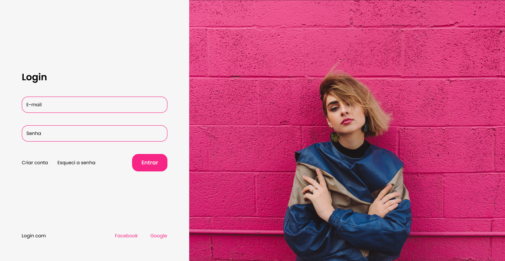

<h1 align="center">My-delivery</h1>

<p align="center">Esse projeto é uma plataforma de cursos com seção para membros free e premium.</p>

---

<h1 align="center">
  
</h1>

<a href="https://andersonszdc.com">Ver o projeto no ar (em breve)</a>

### Features
- [x] Sincronização entre o Firebase e o Stripe (webhook)
- [x] Login social
- [x] Login cacheado
- [x] Totalmente responsivo
- [x] Checkout online

### Pré-requisitos

Antes de começar, você vai precisar ter instalado em sua máquina as seguintes ferramentas:
[Git](https://git-scm.com), [Node.js](https://nodejs.org/en/).

Além disto é bom ter um editor para trabalhar com o código como [VSCode](https://code.visualstudio.com/)

### Rodando a aplicação

```bash
# Clone este repositório
$ git clone https://github.com/andersonszdc/My-platform

# Acesse a pasta do projeto no terminal/cmd
$ cd My-platform

# Faça uma cópia de '.env.example' para '.env.local'
# Coloque sua credencial da API do Prismic
$ copy .env.example .env.local

# Coloque suas chaves do Firebase e Stripe

# Instale as dependências
$ npm install

# Para iniciar o servidor, execute este comando
$ npm run dev
```


### Tecnologias

As seguintes ferramentas foram usadas na construção do projeto:

- [NextJS](https://www.typescriptlang.org/)
- [TypeScript](https://www.typescriptlang.org/)
- [Styled Components](https://styled-components.com/)
- [Eslint](https://eslint.org/)
- [Stripe](https://stripe.com/br)
- [Firebase](https://firebase.google.com/docs)
- [React-firebase-hooks](https://github.com/csfrequency/react-firebase-hooks)


---

### Autor


Made with 💜 by andersonszdc

<a href="https://www.linkedin.com/in/anderson-souza-b28431198/" target="_blank"></a>
<a href="https://www.instagram.com/andersonszdc" target="_blank"></a>
